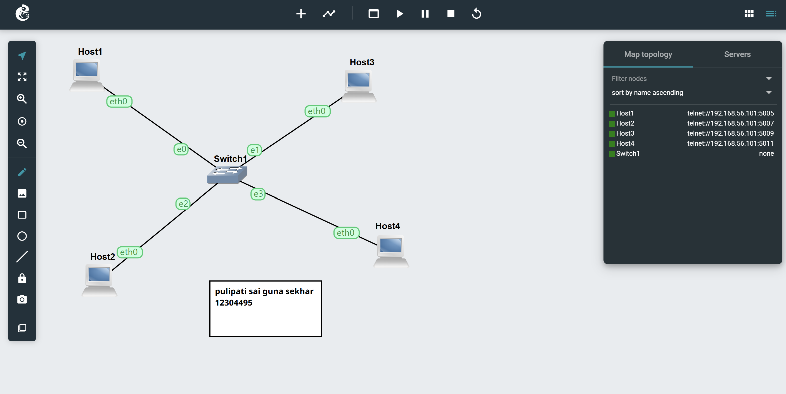
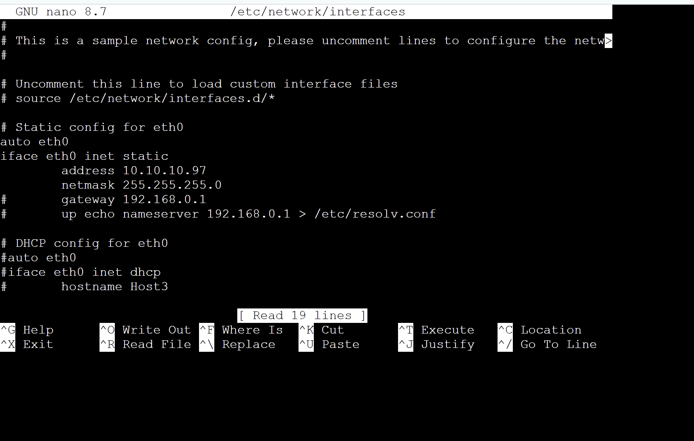
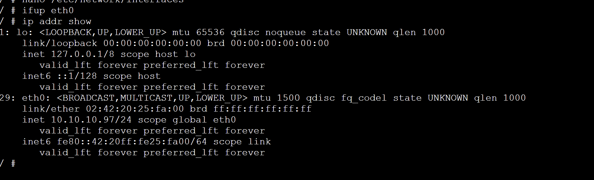
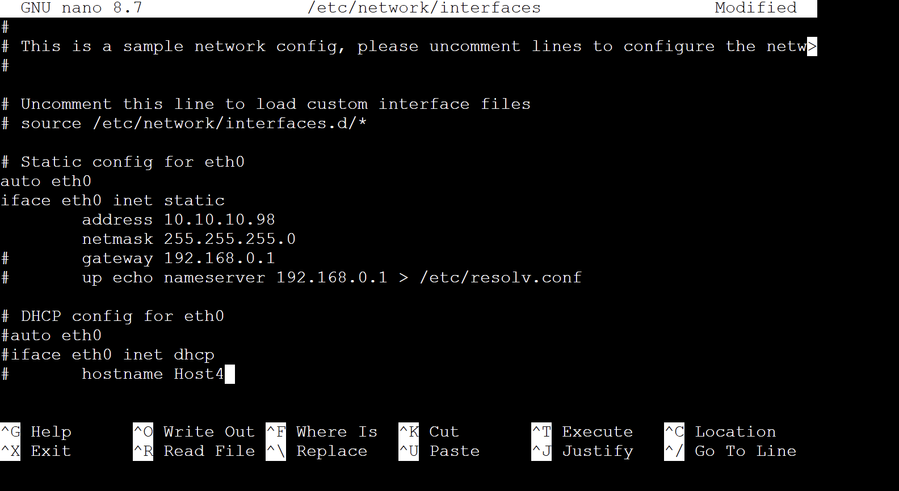
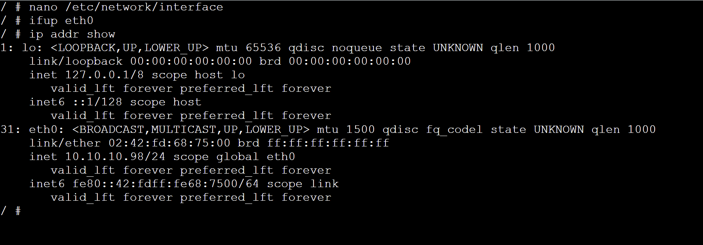
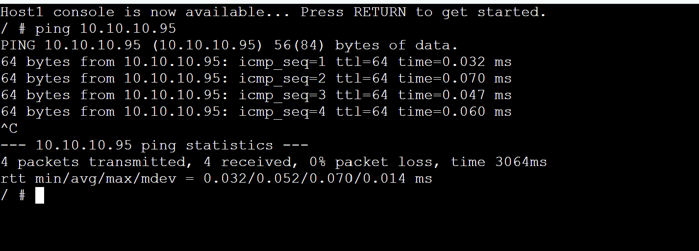
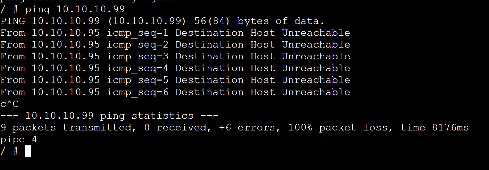
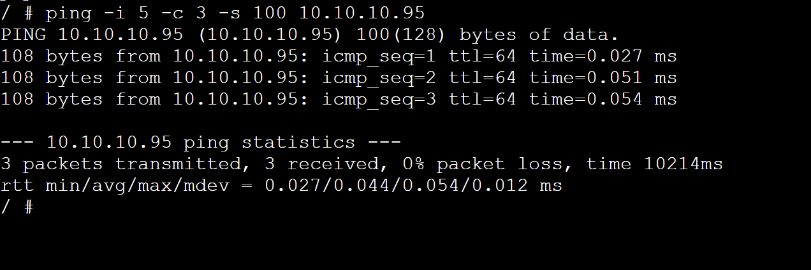
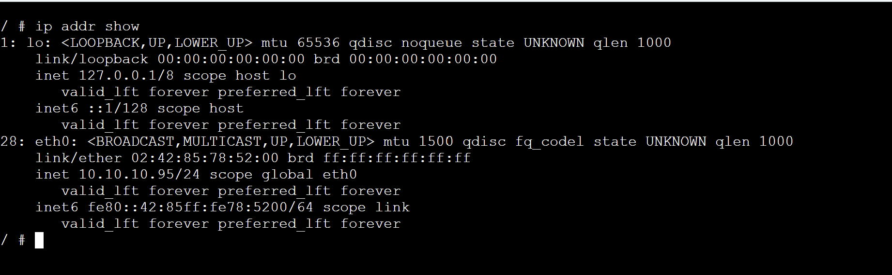
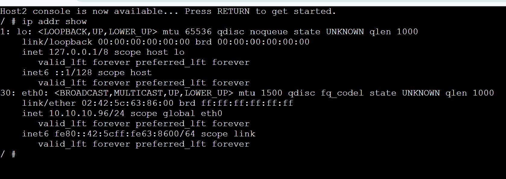

# TASK 1:

 We set up a network in our lab with four computers that run Linux. These computers were connected to each other through a switch. We gave each computer an address that does not change and we did this by using a file called `/etc/network/interfaces`. We checked to make sure this worked by using the `ip addr show` command. Every computer got its special address on the same network, which is `10.10.10.0/24`.

#

# TASK 2: 

#

#

We used the `ping` command to see if the computers could talk to each other. When we used `ping` we got results. The computers could talk to each other without any problems and it did not take long for them to respond. We tried to `ping` an address on purpose and the system told us that the host was unreachable which shows how the system knows when there is a problem.

We also tried ping` settings, like how many times to `ping` how often to `ping` and how big the packets should be to see what would happen when we tested the network.

#

#

So in our lab we were able to set up the Linux computers with their addresses make sure the network was working and test the connection, between the computers, which is what we wanted to do with the Linux environment and the `ping` command and the network.

