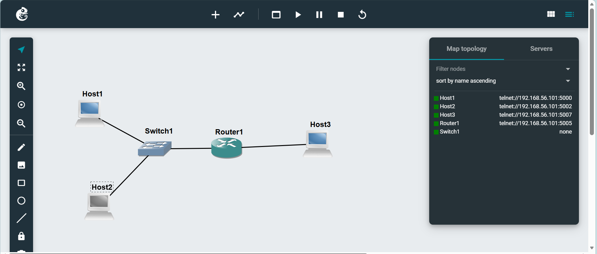
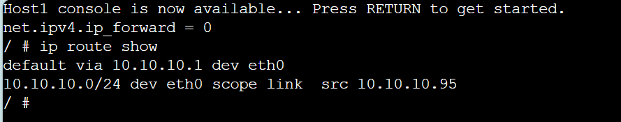
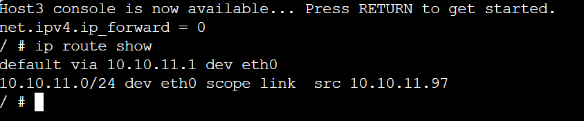
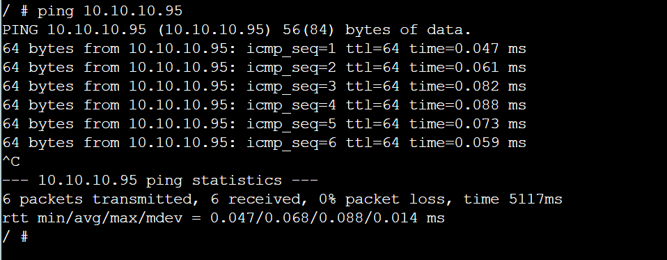
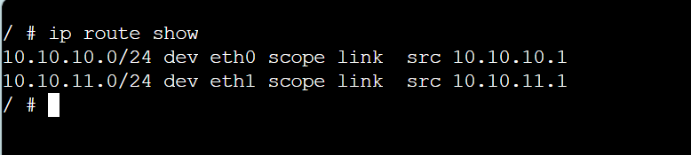
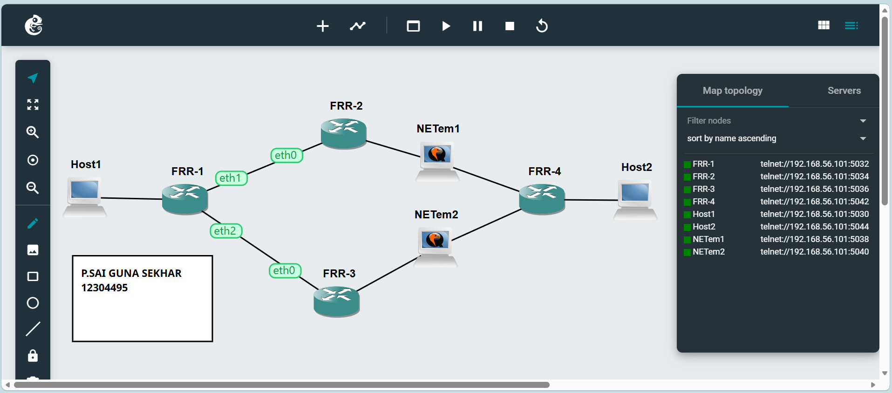

In Task 1 we set up a network with three hosts, one switch and one router. This created two subnets: 10.10.10.0/24 and 10.10.11.0/24.
Each host was given an IP address and a default gateway that pointed to the router.
The hosts did not forward IP packets,. The router did. This helped packets move between networks.

The routing tables were checked using the ip route show command.
The results showed that each host had a route to its own subnet and a default route through the router.
The router had routes to both subnets.

