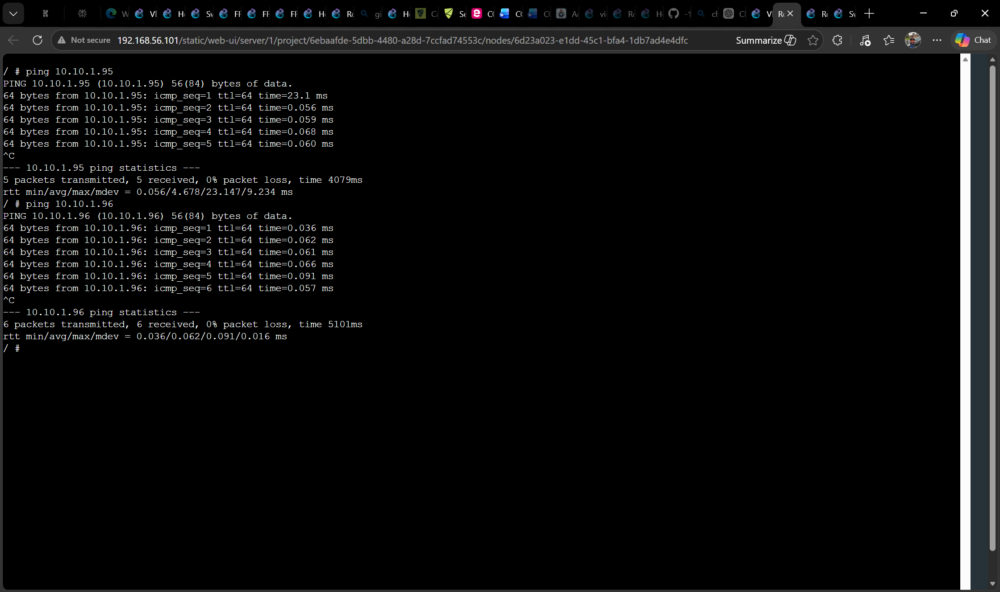
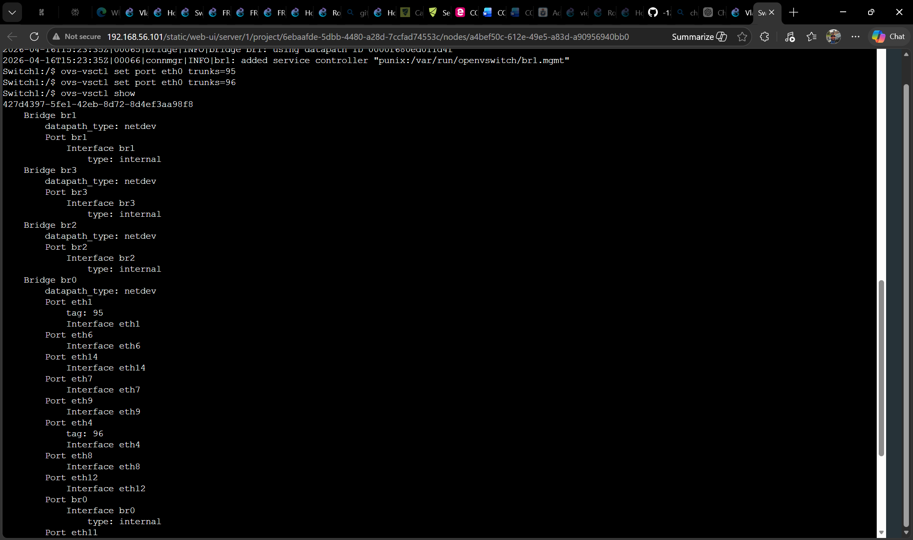
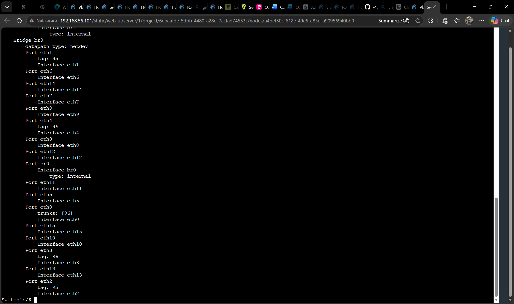

# TASK 1:

Task 1 is about how devices on a network find each others hardware addresses, which are called MAC addresses using something called ARP. So when one device wants to talk to another it first looks at its ARP table to see if it already knows the MAC address for the other devices IP address. If it does not know the MAC address it uses ARP to figure it out. Then it adds this new information to the table.
If you look at the ARP table before and after devices talk to each other you can see how the information, in the table changes as devices communicate with the ARP table and each other. The ARP table gets updated with entries as devices start talking to each other.

# Task 2:

