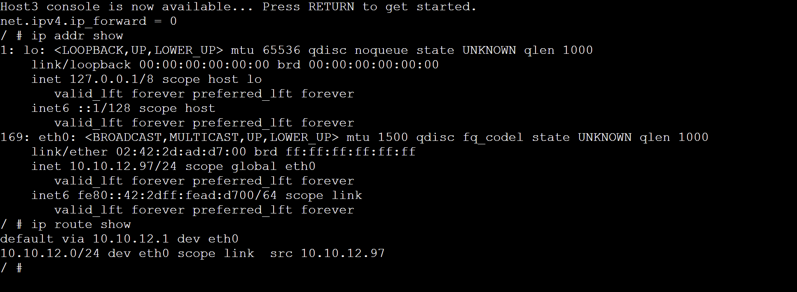
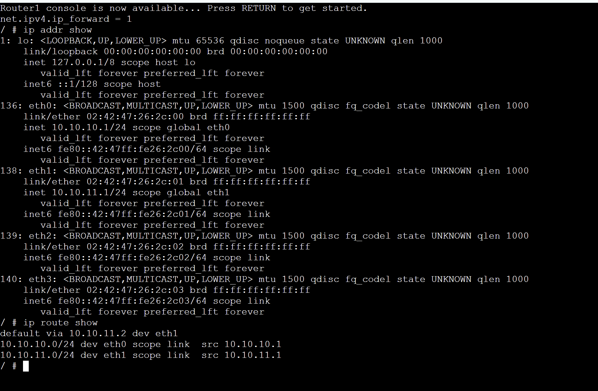
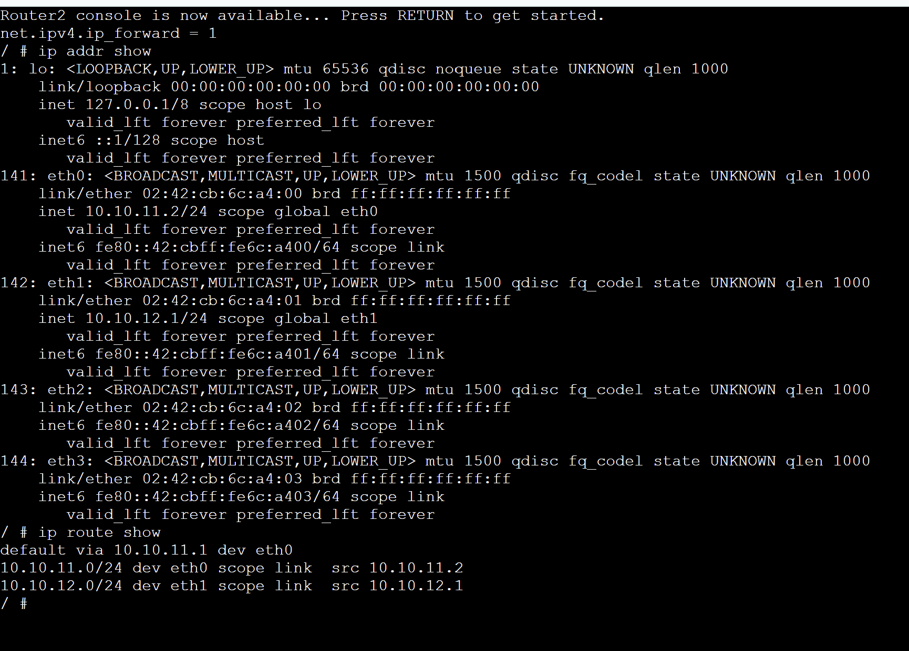

# TASK 1:

In Task 1 the focus is on how devices on the network find each others MAC addresses using ARP. When Host1 tries to connect to another host it sends a ping request. Since the MAC address is not known ARP is used to figure it out.
Once the ping works the ARP table gets updated with the IP and MAC address. It says REACHABLE.
If Host1 talks to the host again or to a different one, like 10.10.10.97 more entries are added to the ARP table.
Over time if a device is not used its entry in the ARP table can change to STALE. This means ARP is always learning and remembering these associations based on what's happening on the network.
The ARP table is like a list that keeps track of all the devices, on the network and their MAC addresses. The ARP table is very important for devices to be able to talk to each other on the network.

# TASK 2:

In Task 2 the network is divided into smaller networks that are connected by two routers. Each computer on the network has its IP address and a default gateway like 10.10.10.1, which lets it talk to other computers outside its own local network. The routers are set up to packets so they can move information from one network to another. If you look at the routing tables you can see that each device knows about its local network and the default route that it uses to get to the router. When a computer in one network tries to ping a computer in another network the packet goes through Router1 and Router2 which shows that the computers can communicate with each other. This shows how routing and default gateways help computers in networks talk to each other which is different, from Task 1 where everything was only connected to one local network.

These activities show us two things about networking: ARP and routing. The first task shows that when we are on the network we need ARP to change IP addresses into MAC addresses. This helps devices know who they are talking to. The second task shows how we can talk to devices on networks. We use something called default gateways and routers to do this. We also need things called routing tables and IP forwarding.
Both of these tasks teach us that we need **ARP** to figure out addresses on our network and **routing** to talk to other networks. We need both ARP. Routing to make sure data gets where it needs to go both on our own network and, on other networks.

